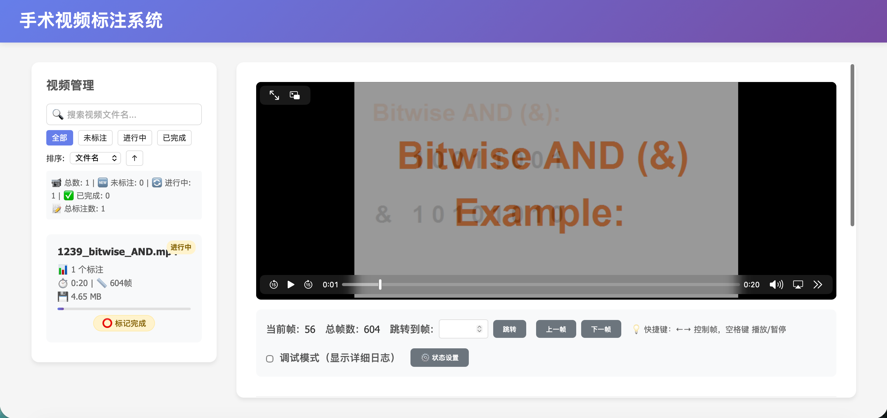
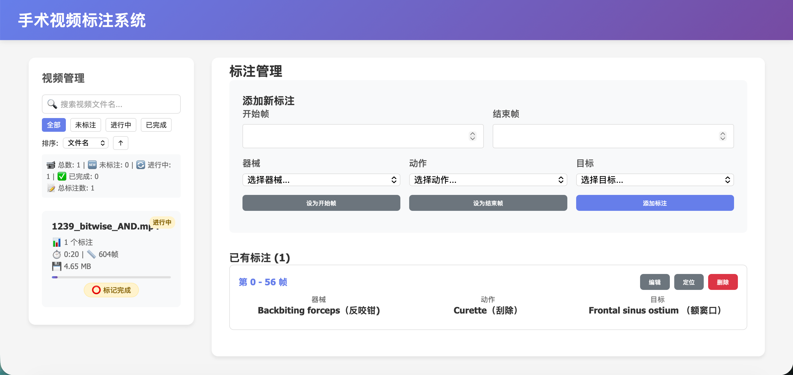

# 手术视频三元组标注系统

一个基于 Flask 的本地视频标注工具，用于对手术视频进行三元组标注：器械、动作、目标。

项目面向本地离线使用场景，支持浏览视频、逐帧定位、添加/编辑/删除标注，并通过外部配置文件自定义三元组字段展示文案与是否允许手动输入。

## 功能特性

- 视频列表浏览与检索
- 按帧区间添加三元组标注
- 支持编辑、删除、定位已有标注
- 支持 AVI 视频在线播放转换
- 标注结果按视频单独存储为 JSON
- 三元组候选项从 `data/三元组.csv` 加载
- 三元组字段标签与自定义输入开关可通过 `data/app_config.json` 修改
- 支持 PyInstaller 打包为可编辑文件夹版应用

## 界面展示

### 主界面



### 标注表单



如需继续补充界面展示，可以将更多截图放到 `docs/images/` 目录，并在此处继续引用。

## 目录结构

```text
video_triple/
├── app.py
├── requirements.txt
├── README.md
├── .gitignore
├── 视频标注系统.spec
├── data/
│   ├── app_config.json
│   └── 三元组.csv
├── docs/
│   └── images/
│       ├── .gitkeep
│       └── README.md
├── static/
│   └── .gitkeep
└── templates/
    └── index.html
```

## 环境要求

- Python 3.10 及以上
- macOS、Linux、Windows 均可运行
- 建议使用虚拟环境

## 安装与启动

1. 安装依赖

```bash
pip install -r requirements.txt
pip install pyinstaller
```

2. 启动开发环境

```bash
python app.py
```

3. 打开浏览器

默认地址：

```text
http://localhost:4000
```

## 数据与配置

### 三元组候选项

文件路径：`data/三元组.csv`

CSV 三列分别对应：

- 器械
- 动作
- 目标

修改该文件后，刷新页面即可读取新的候选项。

### UI 配置

文件路径：`data/app_config.json`

当前支持：

- 修改三元组字段标题
- 修改下拉框占位文案
- 修改自定义输入框占位文案
- 配置是否允许自定义输入

示例：

```json
{
  "triplet_fields": {
    "instrument": {
      "label": "器械",
      "select_placeholder": "选择器械...",
      "custom_placeholder": "输入自定义器械名称"
    },
    "action": {
      "label": "动作",
      "select_placeholder": "选择动作...",
      "custom_placeholder": "输入自定义动作名称"
    },
    "target": {
      "label": "目标",
      "select_placeholder": "选择目标...",
      "custom_placeholder": "输入自定义目标名称"
    }
  },
  "triplet_customization": {
    "allow_custom_input": true,
    "custom_option_label": "🖊️ 自定义输入"
  }
}
```

## 标注数据输出

运行时会自动生成以下目录和文件：

- `data/videos/`：待标注视频
- `data/annotations/`：每个视频的标注 JSON
- `data/server.log`：运行日志

这些运行时文件已经加入 `.gitignore`，不建议提交到仓库。

## 打包发布

统一使用根目录的 spec 文件，且默认打包为 `onedir` 可编辑文件夹版：

```bash
pyinstaller --clean --noconfirm 视频标注系统.spec
```

打包结果位于：

```text
dist/视频标注系统/
```

打包后可直接编辑：

- `dist/视频标注系统/data/三元组.csv`
- `dist/视频标注系统/data/app_config.json`

不需要重新编译即可调整候选项和字段展示配置。

## 开发说明

- 后端：`app.py`
- 前端模板：`templates/index.html`
- 打包入口：`视频标注系统.spec`

如果准备对外开源，建议在发布前再补充：

- `LICENSE`
- Release 截图
- 示例视频与示例标注数据说明
- 贡献指南 `CONTRIBUTING.md`

## License

尚未指定。开源发布前请根据需要添加 `LICENSE` 文件。
